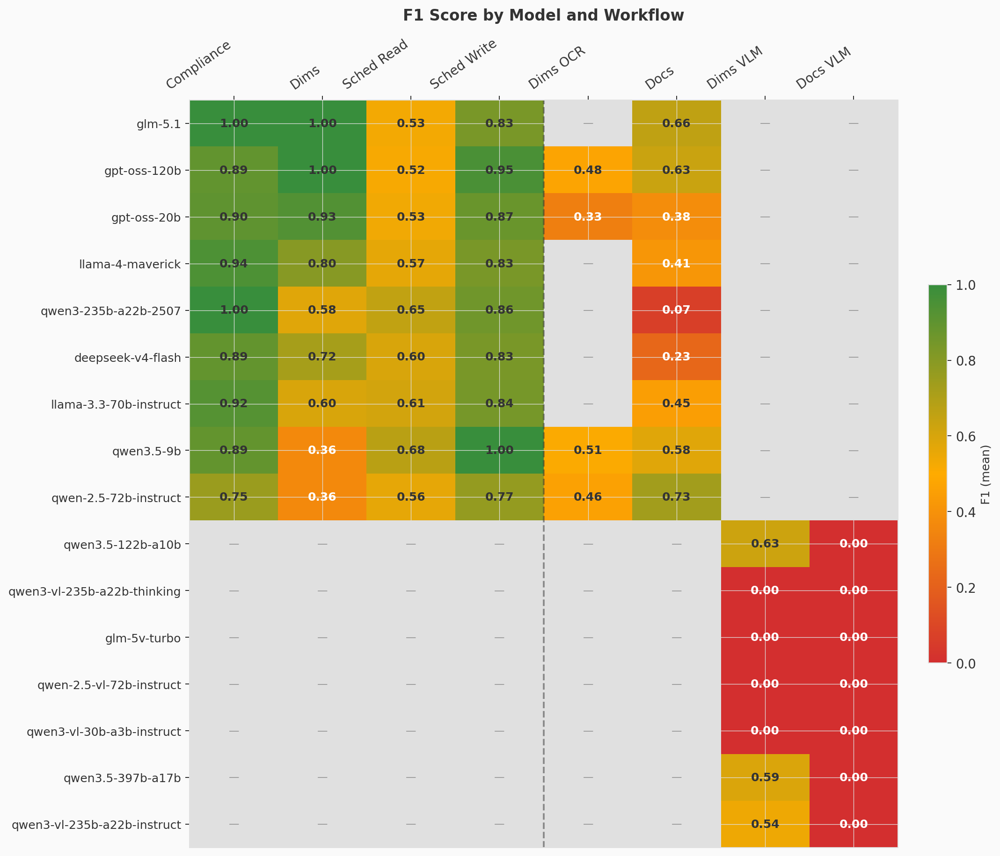
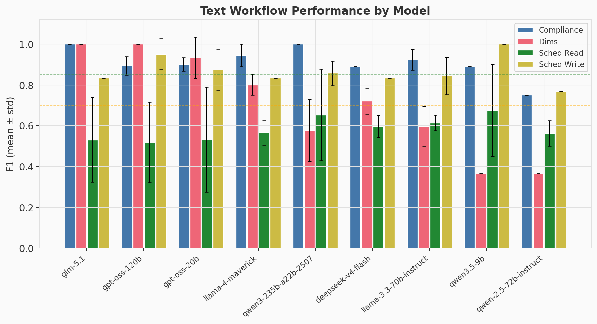
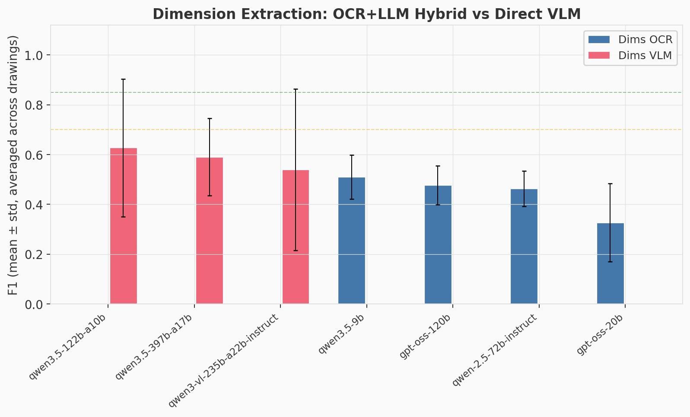
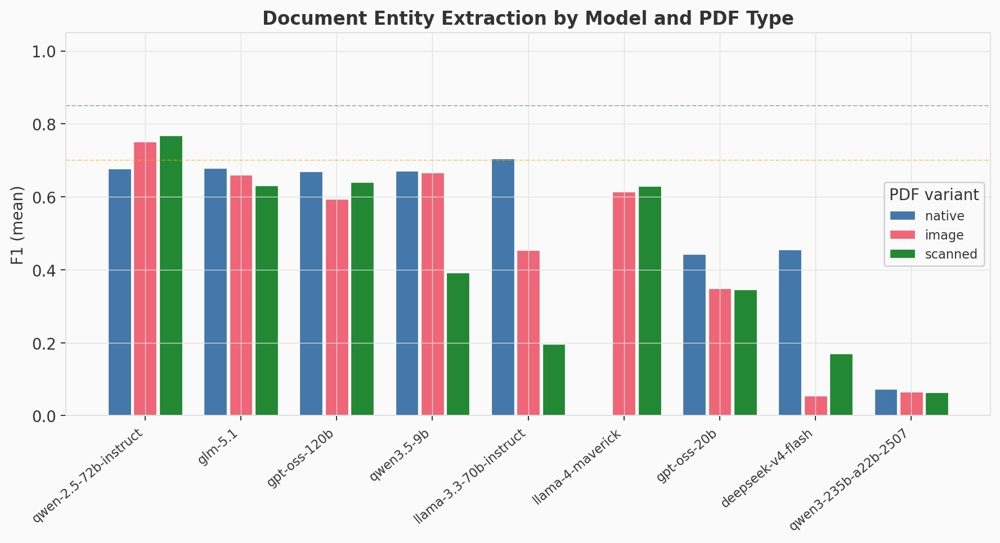
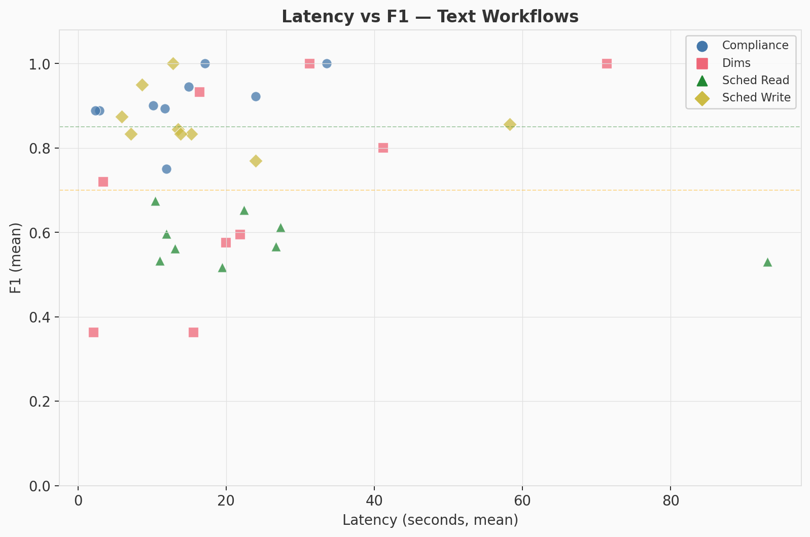

# Local AI Models for Businesses Experiment

A validation harness that benchmarks open-source LLMs on six real-world business workflows commonly found in SME operations and engineering teams. The goal: measure whether locally-hosted open models on commodity GPU hardware can reliably handle the assistive-AI tasks that small and mid-sized businesses actually need — and identify the cheapest hardware tier that still works.

## Why this exists

Public LLM benchmarks (MMLU, HumanEval, GPQA) measure general capability. They don't answer the question a 50-person manufacturer or engineering firm actually asks: *"Can a 70B model running on a workstation I can buy replace the repetitive knowledge work my team does every week?"*

This experiment bridges that gap with six task types drawn from real ICP (Ideal Customer Profile) workflows, grounded in actual consulting engagements with manufacturing and engineering SMEs.

## What's tested

**Default workflows** (included in `--workflow all`):

| Workflow | Real-world analog | What it tests |
|---|---|---|
| `compliance` | Quality engineer comparing an incoming material certificate against a customer specification | Multi-attribute compliance reasoning, tolerance logic, structured flag-with-justification output |
| `dims` | Production engineer cross-checking drawn dimensions against CAM-extracted dims | Tabular comparison, 10%-tolerance-band rule, false-positive cost awareness |
| `dims_vlm` | Same engineer extracting dimensions directly from a drawing image | Direct VLM reading of engineering drawing callouts, table reconstruction |
| `docs` | Operations manager pulling structured fields out of a mixed pile of PDFs (English native + German scanned) | OCR fallback, multilingual NER, schema-conformant JSON output |
| `schedule_read` | PM scanning a project plan for issues humans miss | Spreadsheet ingestion, multi-row dependency reasoning |
| `schedule_write` | PM updating a plan after a supplier delay, with cascade propagation | Multi-cell coordinated write, protected-region awareness |

**Appendix workflows** (run explicitly via `--workflow`):

| Workflow | What it tests | Why appendix |
|---|---|---|
| `dims_ocr` | OCR + LLM hybrid dimension extraction | OCR bottleneck caps recall at ~0.70; direct VLM path is superior (see `docs/FIRST_RUN_INSIGHTS.md`) |
| `docs_vlm` | Direct VLM PDF entity extraction | Provider infrastructure issues in first run; `docs` with OCR fallback is the primary path |

Coverage: text/data, image/vision, PDF (native + scanned OCR), spreadsheet read, spreadsheet write.

## Model ladder

**Anchor models** (closed-source reference ceilings, not local-deployment candidates):

| Model | Provider | Purpose |
|---|---|---|
| `gpt-5.5-2026-04-23` | OpenAI (direct) | GPT-5.5 — lets readers interpret open-model scores as "X% of GPT-5.5" |
| `claude-opus-4-6` | Anthropic | Claude Opus 4.6 — second closed-model reference point |

**Open-model text ladder** (compliance, dims, docs, schedule_read, schedule_write):

| Model | Size | Hardware tier (Q4 inference) |
|---|---|---|
| `qwen/qwen3-235b-a22b-2507` | 235B MoE (~22B active) | Tier 2+ |
| `openai/gpt-oss-120b` | 120B MoE | Tier 2 (~60 GB VRAM) |
| `meta-llama/llama-4-maverick` | ~400B MoE (~17B active) | Tier 2 |
| `qwen/qwen-2.5-72b-instruct` | 72B | Tier 1+ (~40 GB) |
| `meta-llama/llama-3.3-70b-instruct` | 70B | Tier 1+ (~40 GB) |
| `deepseek/deepseek-v4-flash` | MoE (size unverified) | Tier 1+ |
| `z-ai/glm-5.1` | ? (unverified) | Tier 1+ |
| `openai/gpt-oss-20b` | 20B | Tier 0.5 (~12 GB) |
| `qwen/qwen3.5-9b` | 9B | Tier 0 (~6 GB) |

**VLM ladder** (dims_vlm) -- routed via OpenRouter, plus anchor models:

| Model | Size | Hardware tier (Q4, self-hosted) |
|---|---|---|
| `qwen/qwen3-vl-235b-a22b-instruct` | 235B MoE (~22B active) | Tier 2.5 (~140 GB) |
| `qwen/qwen3.5-122b-a10b` | 122B MoE (~10B active) | Tier 2 (~70 GB) |
| `qwen/qwen3.5-397b-a17b` | 397B MoE (~17B active) | Tier 3 (~225 GB) |
| `qwen/qwen3-vl-235b-a22b-thinking` | 235B MoE (Thinking) | Tier 2.5 |
| `qwen/qwen-2.5-vl-72b-instruct` | 72B | Tier 1+ (~40 GB) |
| `qwen/qwen3-vl-30b-a3b-instruct` | 30B MoE (~3B active) | Tier 0.5 (~18 GB) |

**Hardware tiers:**

| Tier | Example GPU | Approx. cost | Runs |
|---|---|---|---|
| Tier 2 | 2x RTX 6000 Ada (96 GB) | ~16-18k | Everything including 120B MoE |
| Tier 1 | 1x RTX 6000 Ada (48 GB) | ~9-11k | 70-72B comfortably |
| Tier 0.5 | 1x RTX 4090 / RTX 5000 Ada (24-32 GB) | ~4-6k | 32B comfortably |
| Tier 0 | 1x RTX 4070 Ti Super (16 GB) | ~1.5-2.5k | 7-9B class |

The key question: if a smaller model still hits acceptable precision/recall, can we recommend a cheaper hardware tier?

**Providers:** Tensorix (open models), OpenRouter (VLM routing), OpenAI (GPT-5.5 direct), Anthropic (Claude Opus 4.6).

## Setup

1. **Install [uv](https://docs.astral.sh/uv/):**

   ```bash
   curl -LsSf https://astral.sh/uv/install.sh | sh                                     # macOS / Linux
   powershell -ExecutionPolicy ByPass -c "irm https://astral.sh/uv/install.ps1 | iex"   # Windows
   ```

2. **Install dependencies:**

   ```bash
   uv sync
   ```

3. **Configure credentials.** Copy `.env.example` to `.env` and fill in your API keys:

   ```bash
   cp .env.example .env
   ```

   You need at minimum a [Tensorix](https://tensorix.ai) API key for the open-model ladder. Additional optional keys: OpenRouter (VLM workflows), OpenAI (GPT-5.5 anchor), Anthropic (Opus 4.6 anchor). See `.env.example` for all options.

4. **Verify input data** is present under `data/` (see [Project structure](#project-structure) below).

## Usage

```bash
# Smoke test -- 1 run per combination (~64 LLM calls, 5-10 minutes)
uv run python run_experiment.py --runs 1

# Full statistical run -- 10 runs per combination (~640 LLM calls, 60-120 minutes)
uv run python run_experiment.py --runs 10

# Skip OCR-heavy dims_ocr (text + PDF + xlsx workflows only)
uv run python run_experiment.py --runs 10 --no-extract

# Single workflow
uv run python run_experiment.py --workflow schedule_write --runs 10
uv run python run_experiment.py --workflow docs --pdfs llm_finetuning_report.pdf llm_finetuning_report_scanned.pdf --runs 5

# Override model list
uv run python run_experiment.py --runs 10 --models meta-llama/llama-3.3-70b-instruct qwen/qwen3.5-9b

# Parallel execution -- 4 combos in parallel, 0.5s delay between API calls
uv run python run_experiment.py --runs 10 --workers 4 --delay 0.5

# Fast parallel smoke test
uv run python run_experiment.py --runs 1 --workers 8 --delay 0.2
```

## Outputs

Each run produces:

- `results/run_<timestamp>.json` -- full raw results + per-combo aggregates (mean/std/min/max for precision, recall, F1, latency, plus raw model outputs)
- `results/summary_<timestamp>.md` -- side-by-side markdown table grouped by workflow
- **stdout** -- compact summary table

## How to read the numbers

| Metric | Meaning |
|---|---|
| Precision | Of items the model flagged/extracted, what fraction were correct? |
| Recall | Of items it should have flagged/extracted, what fraction did it catch? |
| F1 | Harmonic mean of precision and recall |
| CI 95% | Bootstrap 95% confidence interval for the metric mean |
| Runs ok | Successful runs / total runs (reliability indicator) |
| Latency mean (s) | Average end-to-end LLM call time per run |

**Two score sets** are reported:
- **F1 all** -- all failed runs score 0.0 (penalizes unreliable providers)
- **F1 succ** -- only successful runs count (measures pure model capability)

Use **F1 succ** as the primary capability metric, qualified by **Runs ok** (reliability). A model with F1 succ = 0.95 but Runs ok = 3/10 is capable but unreliable on that provider.

**Verdict heuristics:**

- Both P and R >= 0.85, std < 0.10 -- **strong pass** (capable of human-in-the-loop pilot)
- Both >= 0.70 -- **pass** (feasible with attention to false-positive triage)
- Either < 0.70 -- **weak / fail** (needs prompt iteration or a different model)

For `schedule_write`: the `forbidden_row_violations` field in the raw JSON shows whether the model touched rows it was told not to -- a real-world risk signal even if precision/recall look fine.

## Results (N=10 runs, May 2026)

### Overview: F1 by model and workflow

The heatmap below shows the mean F1 score for every (model, workflow) combination. Text workflows use models directly; multi-input workflows (dims_ocr, dims_vlm, docs, docs_vlm) show the model-averaged F1 across all input variants. Grey cells indicate the model was not tested on that workflow.



**Key takeaways:**
- **Compliance** and **schedule_write** are broadly solved -- most models score >= 0.83, several hit perfect F1.
- **Dims** (tabular comparison reasoning) separates models sharply: gpt-oss-120b and glm-5.1 score 1.00, while smaller models struggle with the tolerance-band logic.
- **Schedule_read** is the hardest text workflow -- no model exceeds F1 0.68, suggesting multi-row dependency reasoning remains a challenge.
- **Docs_vlm** (direct VLM on PDF pages) was a complete failure across all VLM models tested via OpenRouter, all scoring 0.00 due to provider-side errors.

### Text workflows: compliance, dims, schedule_read, schedule_write



Dashed lines mark the "strong pass" (0.85, green) and "pass" (0.70, yellow) thresholds. Error bars show standard deviation across 10 runs. Compliance is consistently high across the ladder. The dims workflow shows the biggest spread: models that understand the 10%-tolerance-band rule (gpt-oss-120b, glm-5.1, gpt-oss-20b) separate cleanly from those that don't.

### Dimension extraction: OCR+LLM hybrid vs direct VLM



Averaged across all 6 engineering drawings. The direct VLM path (sending the raw drawing image to a vision-language model) outperforms the OCR+LLM hybrid path for the larger VLMs (qwen3.5-122b, qwen3.5-397b), but with high variance. Both approaches remain below the 0.85 strong-pass threshold on average, confirming that off-the-shelf models need fine-tuning for reliable engineering drawing extraction.

### Document entity extraction by PDF type



Three PDF variants of the same report: native text, image-based, and scanned. Most models handle native text best; the scanned variant (which triggers EasyOCR fallback) degrades gracefully for the top performers but causes significant drops for smaller models.

### Latency vs F1 trade-off



Each point is one (model, workflow) combination. The ideal operating region is the top-left corner (high F1, low latency). The fastest models (deepseek-v4-flash, qwen3.5-9b) respond in 2-13 seconds; the slowest (glm-5.1 on schedule_read) take ~93 seconds. Compliance and schedule_write cluster in the top-left; dims and schedule_read show more spread.

### Regenerating charts

To regenerate these charts from a results JSON:

```bash
python generate_charts.py results/run_<timestamp>.json
```

Charts are written to `assets/`.

## Project structure

```
agen-ops-6/
├── README.md
├── LICENSE                    # MIT (code) + CC-BY-4.0 (data/prompts)
├── run_experiment.py          # The harness (multi-backend, multi-model, multi-run, 8 workflows)
├── probe_models.py            # Model-probe utility
├── generate_charts.py         # Regenerate result charts from a run JSON
├── pyproject.toml             # uv project (openai, easyocr, pillow, numpy, openpyxl, pymupdf)
├── .env.example               # Credential template
├── .gitignore
├── assets/                    # Chart PNGs embedded in the README
├── docs/
│   ├── METHODOLOGY.md         # Scoring rubrics, sampling settings, limitations
│   └── FIRST_RUN_INSIGHTS.md  # Lessons from the first full run (May 2026)
├── prompts/                   # One system prompt per workflow
├── data/
│   ├── compliance/            # Spec + cert + ground truth (synthetic)
│   ├── dims/                  # Dimension CSVs + engineering drawings + ground truth
│   ├── docs/                  # 3 PDF variants: native, scanned, image-based + ground truth
│   ├── schedule_read/         # Excel timeline with injected scheduling issues + ground truth
│   └── schedule_write/        # Baseline schedule + delay scenario + ground truth
└── results/                   # Run JSONs + summary MDs land here (gitignored)
```

## Protocol

- **N=10 runs** per (model, task) combination for statistical reporting.
- **Temperature / sampling**: fixed across runs (see `run_experiment.py` defaults).
- **EasyOCR** runs locally (CPU is fine for the test inputs) and triggers automatically on scanned PDFs and engineering drawings.
- Hardware tier reasoning assumes **Q4 quantization**. If you use FP8/FP16, re-check VRAM requirements.

For full scoring rubrics, ground-truth construction methodology, and known limitations, see [`docs/METHODOLOGY.md`](docs/METHODOLOGY.md).

## Status and limitations

This is the **v0.5 iteration** of the benchmark. Key improvements from v0.4:

- **Infrastructure vs capability failure separation** -- provider outages no longer silently contaminate model scores.
- **Bootstrap 95% CIs** on all metrics -- uncertainty is visible, not hidden behind point estimates.
- **Closed-model anchor points** (GPT-5.5, Claude Opus 4.6) -- readers can interpret open-model scores relative to frontier models.
- **Provider response header capture** -- `x-provider`, `served_model`, and rate-limit headers are logged for traceability.
- **Multi-backend support** -- Tensorix, OpenRouter, OpenAI (direct), Anthropic.

Things to be upfront about:

- **Model provenance is trust-based.** No provider offers cryptographic verification that served weights match the requested checkpoint. Response headers (`x-provider`, `served_model`) are now captured for traceability, but results should still be read as "model ID X as served by provider Y on date Z."
- **Single-author ground truth.** All ground-truth labels were created by one person. A second-reviewer audit verified all arithmetic (see `docs/FIRST_RUN_INSIGHTS.md`), but systematic blind spots are possible.
- **Synthetic data only.** Inputs are designed to mirror real-world complexity but may not capture the full distribution of production documents.

See [`docs/METHODOLOGY.md`](docs/METHODOLOGY.md) sections 7 and 9 for the full list of known limitations and planned extensions, and [`docs/FIRST_RUN_INSIGHTS.md`](docs/FIRST_RUN_INSIGHTS.md) for lessons from the first full run.

## License

Code: MIT. Data and prompts: CC-BY-4.0. See [`LICENSE`](LICENSE) for full text.

## Author

[Agenovation](https://agenovation.ai) -- achim@agenovation.ai
